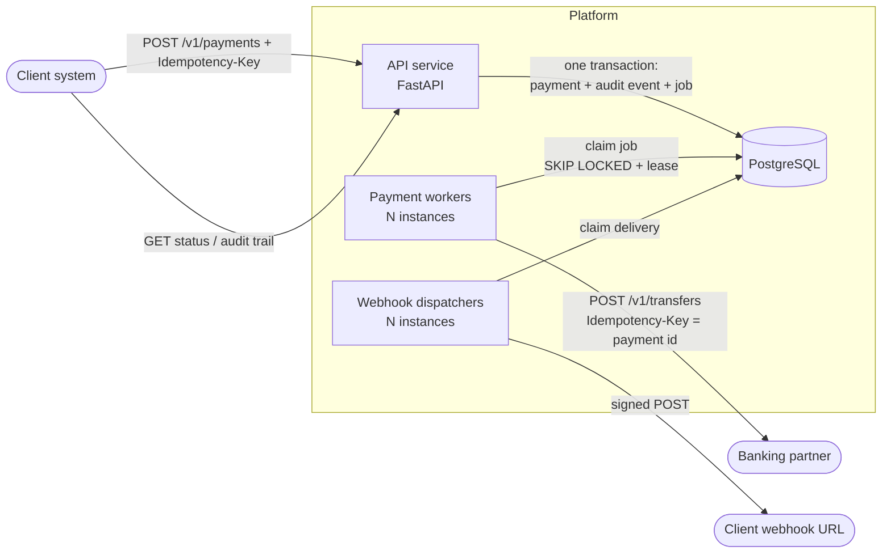
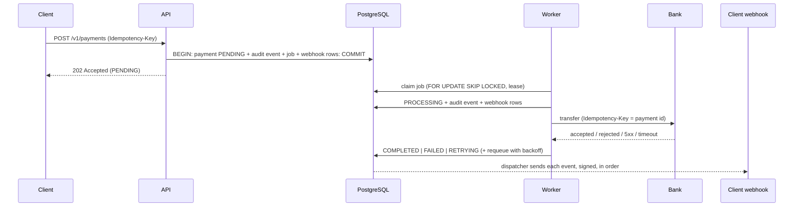
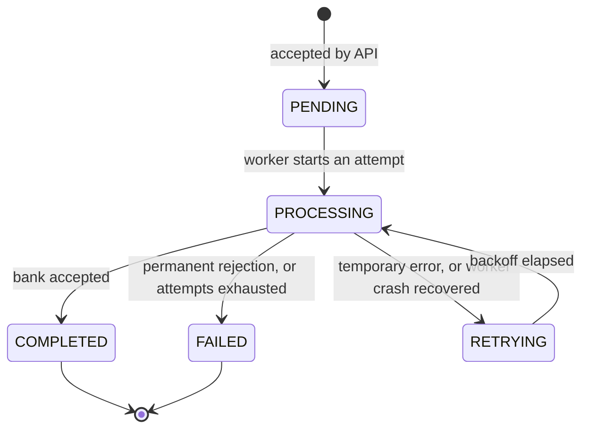

# High-level architecture and solution approach

## Components

The API, workers, and dispatchers are the same codebase started in different roles (`python -m app.main api|worker|dispatcher`), so each scales independently. PostgreSQL is the single source of truth for payments, history, the job queue, and the webhook outbox.

## Payment flow

## Payment lifecycle

## How each failure is handled

| What goes wrong | What happens | Why it is safe |
|---|---|---|
| Client sends the same request twice | Same key + body → original payment returned (`200`). Same reference, new key → `409` | Database unique constraints; one-snapshot lookup |
| Client sends 30 identical requests at the same instant | One wins the insert; the rest see a unique violation, re-read, and get the original | Database constraint decides the race |
| Bank returns 5xx / 429 / network error | `RETRYING`, requeued with exponential backoff + jitter | Retrying a temporary error is safe because of idempotency keys |
| Bank rejects (closed account, invalid data) | `FAILED` immediately, never retried | Retrying would only waste time and bank capacity |
| **Bank times out after moving the money** | `RETRYING`; retry sends the **same** idempotency key; bank returns the original transfer | Money moves exactly once |
| Bank is down for a long time | Circuit breaker opens after N failures; jobs are deferred without spending attempts; one trial call after cooldown | Protects the bank and each payment's retry budget |
| Worker crashes mid-payment | Lease expires; another worker reclaims the job, records a recovery event, retries with the same key | No stuck payments, no double payment |
| A slow "zombie" worker returns after its lease expired | Its lease token no longer matches; its result is discarded | Only the current owner can record an outcome |
| Server restarts | Jobs are rows in PostgreSQL, not memory; processing resumes | Payment and job are saved in one transaction |
| Client's webhook server is down | Delivery retried with backoff up to the limit; then marked `FAILED`, retryable via API | Separate dispatcher: payments are never blocked by webhooks |
| Crash right after a status change | The webhook row was saved in the same transaction (outbox), so it is still sent | Status and notification can't diverge |
| Malicious webhook URL (internal network) | Rejected at registration and checked again at delivery; connection pinned to the vetted IP | Blocks SSRF and DNS rebinding |

## Key design principles

1. **The database is the referee.** Rules that protect money (uniqueness, legal transitions, immutable terms, append-only history) are enforced by PostgreSQL constraints and triggers, so no code path, bug, or manual query can break them.
2. **Write state and intent together.** Payment + job, and status change + audit event + webhook rows, are each written in one transaction.
3. **Never hold a database lock while waiting on the network.** Each worker step is a short transaction; the bank call happens between them.
4. **Every external call is idempotent.** Retrying is always safe, which is what makes automatic recovery possible.
5. **Assume at-least-once, design for exactly-once effects.** Messages may repeat; idempotency keys make repeats harmless.
