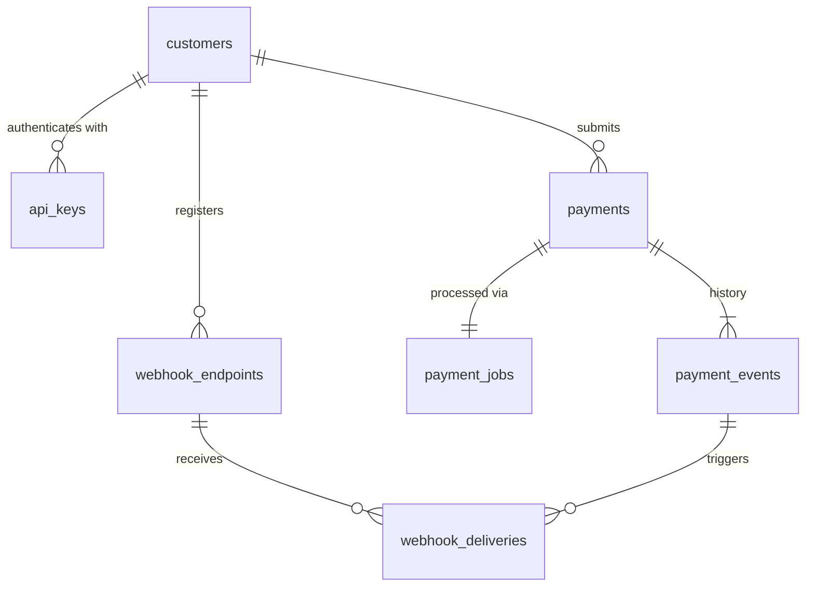

# Data model

PostgreSQL 16. Full schema with comments: [migrations/001_init.sql](../migrations/001_init.sql).

| Table | Purpose | Important columns and rules |
|---|---|---|
| `customers` | Enterprise customers | `id` (e.g. `C12345`), `name` |
| `api_keys` | Authentication | `key_hash` (SHA-256; the key itself is never stored), `key_prefix`, `revoked_at` |
| `payments` | Current state of each payment | `amount_cents` (integer, `> 0`), `status`, `attempts`, `bank_transfer_id`, `last_error_code/message`, `idempotency_key`, `request_hash`, timestamps. **UNIQUE (customer_id, idempotency_key)**, **UNIQUE (customer_id, reference)**, source ≠ destination. Trigger `payments_guard`: only legal status transitions; payment terms immutable after insert |
| `payment_events` | Audit trail | `from_status`, `to_status`, `reason`, `actor` (`api` or `worker:<id>`), `request_id`, `metadata` (JSON), `created_at`. Triggers block UPDATE and DELETE (append-only) |
| `payment_jobs` | Durable work queue, one row per payment | `state` (QUEUED / RUNNING / DONE), `run_at` (when it may next run: implements backoff), `lease_token`, `locked_by`, `lease_expires_at`, `claims` |
| `webhook_endpoints` | Where to send events | `url`, `secret` (for signatures), `enabled` |
| `webhook_deliveries` | Webhook outbox | `payload` (exact bytes signed and sent), `state` (PENDING / DELIVERING / DELIVERED / FAILED), `attempts`, `next_attempt_at`, `last_error`, `last_status_code`. UNIQUE (endpoint_id, event_id) |

## Design notes

- **Money as integer cents.** `250.00` is stored as `25000`. Floating point cannot represent most decimal amounts exactly.
- **Current state + history.** `payments` answers "what is the status now?" quickly; `payment_events` answers "how did it get here?" completely.
- **Partial indexes** (`WHERE state = 'QUEUED'`, `WHERE status IN (...)`) keep queue polling fast even with millions of finished payments.
- **Prefixed ids** (`pay_…`, `whe_…`, `key_…`) are unguessable and show what kind of object an id refers to.
- **`request_hash`** detects a client reusing an idempotency key for a different payment (→ `422`).
